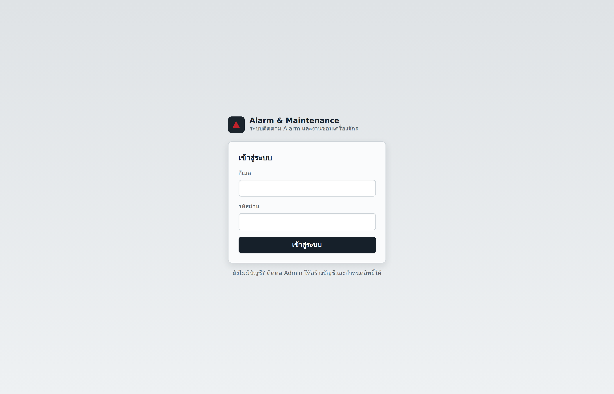
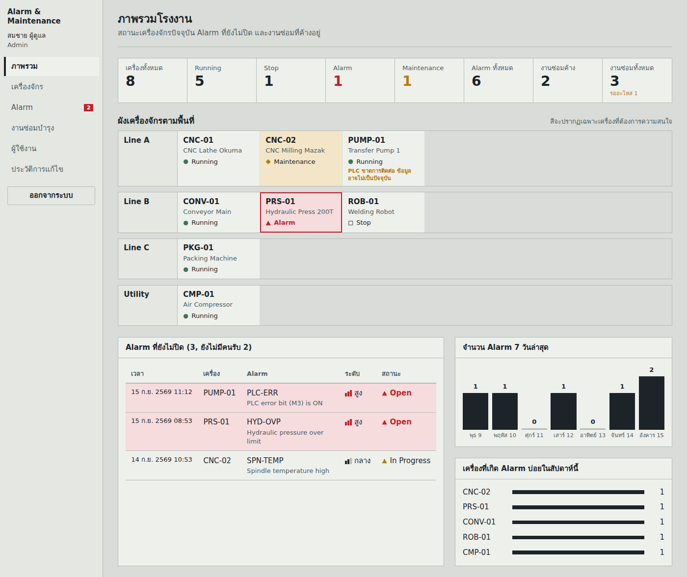
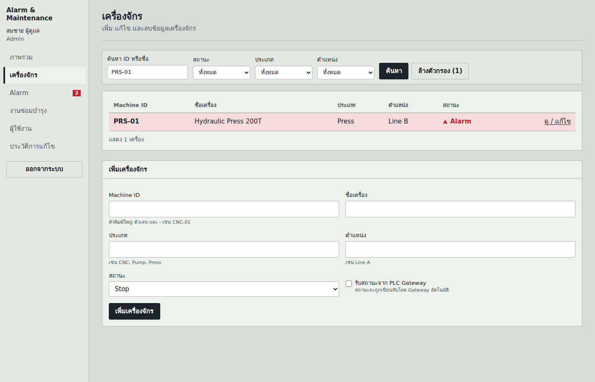
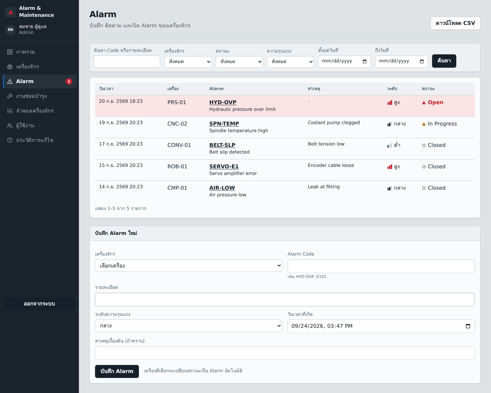
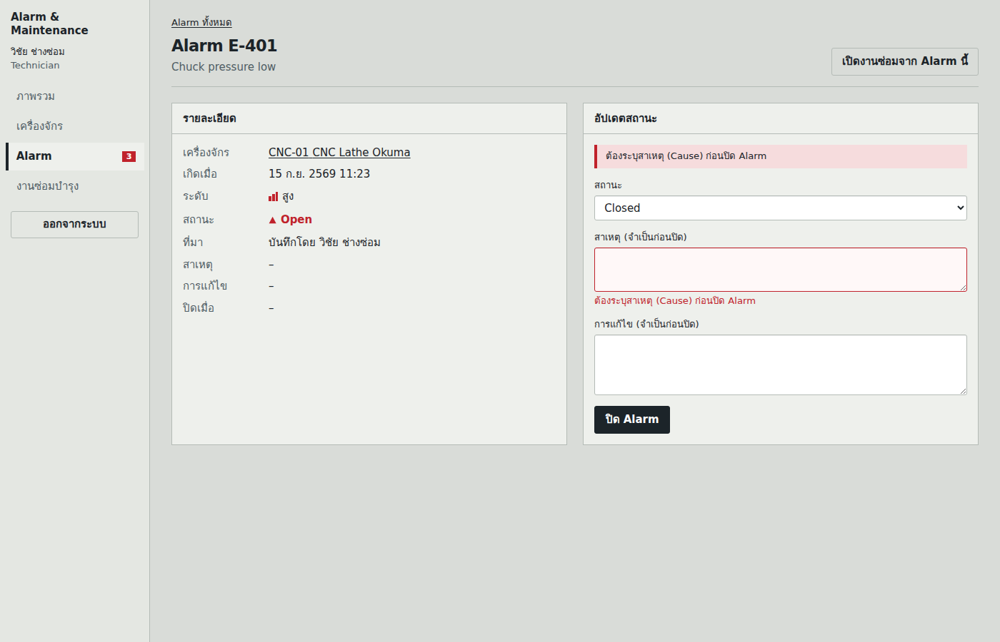
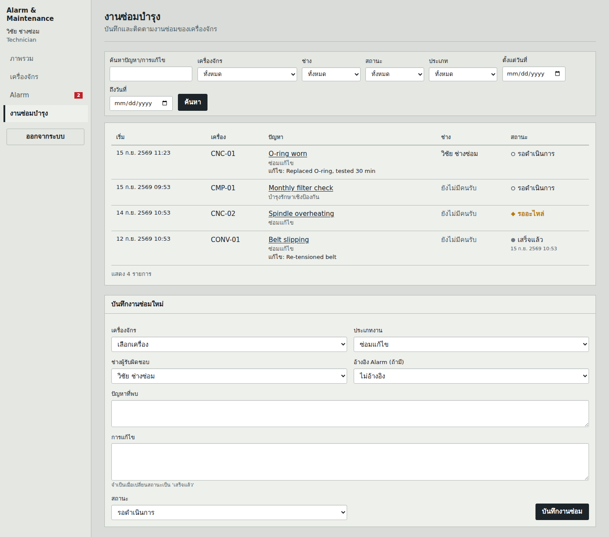

# Alarm & Maintenance Management System

ระบบเว็บสำหรับติดตามสถานะเครื่องจักร บันทึก Alarm และงานซ่อมบำรุงในโรงงาน
งานรายวิชา Programming in Automation Systems

**Vercel URL:** `https://<ใส่ URL หลัง deploy>.vercel.app`
**GitHub:** `repo:sarunyu-d-commits/project-PLC `

---

## 1. วัตถุประสงค์

โรงงานบันทึก Alarm และงานซ่อมไว้หลายที่ ทำให้ค้นประวัติยากและติดตามสถานะงานไม่ชัด ระบบนี้รวมข้อมูลเครื่องจักร Alarm และงานซ่อมไว้ที่เดียว กำหนดสิทธิ์ตามบทบาท และรับสถานะเครื่องจาก PLC ได้ผ่าน Gateway

## 2. ฟังก์ชันหลัก

| ส่วน | สิ่งที่ทำได้ |
|---|---|
| Login / Role | Login-Logout ด้วย Supabase Auth, 3 บทบาท: Admin, Technician, Viewer |
| Machine Master | CRUD ครบ (Admin), ฟิลด์ Machine ID, Name, Type, Location, Status (Running/Stop/Alarm/Maintenance) |
| Alarm Record | Create / Read / Update, สถานะ Open, In Progress, Closed, บันทึกผู้ปิดและเวลาปิดอัตโนมัติ |
| Maintenance Record | Create / Read / Update, อ้างอิง Alarm ได้, สถานะ รอดำเนินการ / กำลังซ่อม / รออะไหล่ / เสร็จแล้ว |
| Search & Filter | เครื่องจักร: คำค้น, สถานะ, ประเภท, ตำแหน่ง<br>Alarm: คำค้น, เครื่อง, สถานะ, ความรุนแรง, ช่วงวันที่<br>งานซ่อม: คำค้น, เครื่อง, ช่าง, สถานะ, ประเภท, ช่วงวันที่ |
| Dashboard | จำนวนเครื่องทั้งหมดและแยกตามสถานะ, จำนวน Alarm และงานซ่อม, ผังเครื่องตามพื้นที่, กราฟ Alarm 7 วัน, เครื่องที่เกิด Alarm บ่อย |
| Validation | ช่องจำเป็นห้ามว่าง, Machine ID ห้ามซ้ำและต้องตรงรูปแบบ, วันเวลา Alarm ห้ามอยู่ในอนาคต, ปิด Alarm ต้องมีสาเหตุและการแก้ไข, งานซ่อมที่เสร็จต้องมีการแก้ไข<br>ตรวจ 3 ชั้น: ฟอร์ม, Server Action, Database constraint |

### ส่วนเพิ่มเติม (Bonus)

- Role **Viewer** (ดูอย่างเดียว)
- สถานะ **Waiting Part** (รออะไหล่)
- หน้า **Machine History** (ไทม์ไลน์ Alarm และงานซ่อมของแต่ละเครื่อง)
- **กราฟ** Alarm รายวัน และเครื่องที่เกิด Alarm บ่อย
- **Export CSV** ของ Alarm ตามตัวกรองที่เลือก (เปิดใน Excel ภาษาไทยได้)
- **Audit Log** บันทึกทุกการเพิ่ม/แก้ไข/ลบ ด้วย trigger ในฐานข้อมูล
- **Responsive UI** ใช้งานบนมือถือได้
- **PLC Gateway** รับสถานะเครื่องจาก Mitsubishi PLC / GX Simulator3 แล้วสร้าง Alarm อัตโนมัติ

## 3. เทคโนโลยี

| ส่วน | ใช้อะไร |
|---|---|
| Frontend + Backend | Next.js 16 (App Router, Server Components, Server Actions, `proxy.ts`) |
| UI | Tailwind CSS v4 |
| Database / Auth | Supabase (PostgreSQL, Row Level Security, Supabase Auth) |
| Validation | Zod |
| Test | Vitest (เว็บ), unittest (Gateway), Playwright (E2E ระหว่างพัฒนา) |
| CI | GitHub Actions |
| Deploy | Vercel |
| PLC Gateway | Python, FastAPI, MX Component (ActUtlType) |

## 4. สถาปัตยกรรม

```
Browser (UI) ──HTTPS──▶ Next.js บน Vercel ──────────▶ Supabase
                        Server Components            Auth + PostgreSQL + RLS
                        Server Actions (ตรวจสิทธิ์)          ▲
                                                             │ service role (อยู่บนเครื่องโรงงานเท่านั้น)
                                                    PLC Gateway (Python)
                                                             ▲
                                                             │ MX Component
                                                    PLC / GX Simulator3
```

การตรวจสิทธิ์มี 3 ชั้น

1. `proxy.ts` กันคนที่ยังไม่ Login
2. `lib/auth.ts` ตรวจ Role ในทุกหน้าและทุก Server Action
3. **RLS ในฐานข้อมูล** เป็นตัวบังคับจริง แม้มีคนเรียก Supabase API ตรง ๆ ก็ทำเกินสิทธิ์ไม่ได้

เว็บไม่เชื่อมกับ PLC โดยตรง (ตามหลัก Integration Layer ในบทที่ 3)

```
app/
  login/                 หน้า Login และ server actions
  (app)/                 หน้าที่ต้อง Login (layout ตรวจสิทธิ์)
    dashboard/ machines/ alarms/ maintenance/ users/ audit/
  api/export/alarms/     Route Handler สำหรับ CSV
components/              UI ที่ใช้ซ้ำ (สถานะ, ฟอร์ม, ตัวกรอง)
lib/
  supabase/              client ฝั่ง server และ proxy
  domain/                กฎธุรกิจ (สถานะ Alarm, mapping PLC) มี unit test
  auth.ts, validation.ts ตรวจสิทธิ์และตรวจข้อมูล
supabase/                schema.sql, seed.sql
gateway/                 PLC API และ Gateway (Python)
tests/                   unit tests
```

## 5. โครงสร้างฐานข้อมูล

```
auth.users 1──1 profiles
machines   1──* alarms
machines   1──* maintenance_records
alarms     1──* maintenance_records   (alarm_id, ไม่บังคับ)
profiles   ◀── alarms.created_by / alarms.closed_by / maintenance_records.technician_id
audit_logs      เขียนโดย trigger เท่านั้น
```

| ตาราง | คอลัมน์สำคัญ |
|---|---|
| `profiles` | `id` (FK auth.users), `full_name`, `role` (admin / technician / viewer) |
| `machines` | `machine_code` (UNIQUE, รูปแบบ A-Z 0-9 และ -), `name`, `machine_type`, `location`, `status`, `plc_linked`, `last_seen_at` |
| `alarms` | `machine_id` (FK, ON DELETE RESTRICT), `alarm_code`, `description`, `severity`, `occurred_at`, `cause`, `action_taken`, `status`, `source` (manual / plc), `created_by`, `closed_by`, `closed_at` |
| `maintenance_records` | `machine_id` (FK), `alarm_id` (FK), `technician_id` (FK), `maintenance_type`, `problem`, `action_taken`, `status`, `started_at`, `completed_at` |
| `audit_logs` | `actor_id`, `table_name`, `record_id`, `action`, `old_data`, `new_data`, `changed_at` |

กฎที่บังคับในระดับฐานข้อมูล

- ปิด Alarm ต้องมี `cause` และ `action_taken`
- Alarm ที่ปิดแล้ว เปิดใหม่ได้เฉพาะ Admin
- ลบเครื่องที่มีประวัติ Alarm หรืองานซ่อมไม่ได้
- ต้องมี Admin อย่างน้อย 1 คน
- Gateway สร้าง Alarm ซ้ำขณะที่ Alarm เดิมยังไม่ปิดไม่ได้ (partial unique index)
- ผู้ใช้ใหม่ได้ Role Viewer อัตโนมัติ
- **สถานะเครื่องตาม Alarm:** มี Alarm ที่ยังไม่ปิด เครื่องเป็น Alarm, ปิด Alarm ตัวสุดท้ายแล้วเครื่องเป็น Stop (ไม่กลับเป็น Running เอง เพื่อให้คนยืนยันก่อนเดินเครื่อง) ยกเว้นเครื่องที่รับสถานะจาก PLC

### สิทธิ์ตาม Role (RLS)

| | Admin | Technician | Viewer |
|---|:-:|:-:|:-:|
| ดูข้อมูลทั้งหมด / Dashboard | ✓ | ✓ | ✓ |
| เพิ่ม/แก้ไข/ลบ Machine | ✓ | – | – |
| บันทึก/อัปเดต Alarm | ✓ | ✓ | – |
| เปิด Alarm ที่ปิดแล้ว | ✓ | – | – |
| บันทึก/แก้ไข Maintenance | ✓ | ✓ | – |
| จัดการ Role ผู้ใช้, ดู Audit Log | ✓ | – | – |

## 6. การติดตั้งและใช้งาน

ต้องมี Node.js 20.9 ขึ้นไป (แนะนำ 22) และบัญชี Supabase

### 6.1 ตั้งค่า Supabase

1. สร้าง Project ใหม่ที่ supabase.com
2. เมนู **SQL Editor** วางเนื้อหา `supabase/schema.sql` แล้วกด Run
3. (ถ้าต้องการข้อมูลตัวอย่าง) วาง `supabase/seed.sql` แล้วกด Run
   > ถ้าเคยรัน `schema.sql` รุ่นก่อนไปแล้ว ไม่ต้องรันใหม่ทั้งไฟล์ ให้รันไฟล์ใน `supabase/migrations/` ที่ยังไม่เคยรันตามลำดับเลข
4. เมนู **Authentication > Users > Add user** สร้างผู้ใช้ (ติ๊ก Auto Confirm)
5. ตั้งผู้ใช้คนแรกเป็น Admin ใน SQL Editor
   ```sql
   update public.profiles set role = 'admin'
   where id = (select id from auth.users where email = 'admin@example.com');
   ```
   ผู้ใช้คนอื่นให้ Admin เปลี่ยน Role ได้ที่หน้า **ผู้ใช้งาน** ในเว็บ

### 6.2 รันในเครื่อง

```bash
npm install
cp .env.example .env.local      # ใส่ค่าจาก Supabase > Project Settings > API
npm run dev                     # เปิด http://localhost:3000
```

| ตัวแปร | ค่า |
|---|---|
| `NEXT_PUBLIC_SUPABASE_URL` | Project URL |
| `NEXT_PUBLIC_SUPABASE_PUBLISHABLE_KEY` | Publishable key (`sb_publishable_...`) หรือ anon key |

> **ความปลอดภัย:** สองค่านี้เป็นค่าสาธารณะ ห้ามใส่ Service Role Key หรือ Secret Key ในโปรเจค Next.js และห้าม commit ไฟล์ `.env*` (`.gitignore` กันไว้แล้ว และ CI ตรวจซ้ำอีกชั้น)

### 6.3 คำสั่งอื่น

```bash
npm run lint        # ESLint
npm run typecheck   # TypeScript
npm test            # Unit tests (Vitest)
npm run build       # Production build
```

### 6.4 Deploy บน Vercel

1. Push โค้ดขึ้น GitHub
2. Vercel > **Add New Project** แล้วเลือก repo
3. ใส่ Environment Variables 2 ตัวเดียวกับ `.env.local` **ก่อนกด Deploy** (ค่า `NEXT_PUBLIC_*` ถูกฝังตอน build ถ้าเพิ่มทีหลังต้องกด Redeploy)
4. Supabase > **Authentication > URL Configuration** ใส่ Vercel URL เป็น Site URL

### 6.5 GitHub Actions

`.github/workflows/ci.yml` ทำงานทุกครั้งที่ push และแสดงผล Passed/Failed ในแท็บ Actions

1. **web**: Install (`npm ci`), Lint, Type check, Unit tests, Build
2. **gateway**: ตรวจ syntax และรัน unit test ของ Gateway
3. **secrets-guard**: ล้มเหลวถ้ามีไฟล์ `.env` ถูก commit หรือมี Service Role Key ในโค้ดเว็บ

### 6.6 PLC Gateway (ส่วนเสริม)

รันบนเครื่อง Windows ที่ติดตั้ง GX Works3 / MX Component หรือใช้ mock mode บนเครื่องใดก็ได้

```bash
cd gateway
pip install -r requirements.txt     # เครื่องที่ต่อ PLC จริงให้ pip install pywin32 เพิ่ม
cp .env.example .env                # ใส่ SUPABASE_URL และ SUPABASE_SERVICE_ROLE_KEY
uvicorn plc_api:app --host 127.0.0.1 --port 8000
```

1. ในเว็บ แก้เครื่อง `PUMP-01` แล้วติ๊ก **รับสถานะจาก PLC Gateway**
2. Gateway อ่าน M0 (PWR), M1 (RUN), M3 (ERR) ทุก 3 วินาที แล้วอัปเดตสถานะเครื่อง
3. เมื่อ M3 เปลี่ยนเป็น 1 จะสร้าง Alarm `PLC-ERR` หนึ่งรายการ ช่างต้องปิดเองในเว็บพร้อมระบุสาเหตุ
4. ถ้า Gateway หยุดส่งข้อมูลเกิน 30 วินาที Dashboard จะแสดง "PLC ขาดการติดต่อ"

ทดสอบใน mock mode

```bash
curl -X POST localhost:8000/api/plc -H "X-API-Key: <PLC_API_KEY>" \
  -H "Content-Type: application/json" -d '{"device":"M3","value":1}'
```

สิ่งที่ปรับจาก `plc_api.py` เดิม

- `POST /api/plc` ต้องมี API key และเขียนได้เฉพาะ device ที่อนุญาต
- Gateway ส่งข้อมูลเข้า Supabase แทนการให้เว็บเรียก PLC โดยตรง
- mock mode ใช้ lock กันข้อมูลชนกันระหว่าง API กับ Gateway
- เชื่อมต่อ COM ครั้งเดียวต่อ thread และต่อใหม่อัตโนมัติเมื่ออ่านค่าผิดพลาด

## 7. การทดสอบ

| ระดับ | จำนวน | ครอบคลุม |
|---|---|---|
| Unit (Vitest) | 22 | Validation, กฎเปลี่ยนสถานะ Alarm, mapping PLC |
| Unit (Gateway) | 7 | สร้าง Alarm ครั้งเดียว, retry เมื่อเครือข่ายล่ม, ไม่สร้างซ้ำหลังรีสตาร์ท |
| Database (SQL) | – | RLS ของแต่ละ Role, constraint, trigger |
| End-to-end (Playwright) | 35 | Login/สิทธิ์, CRUD, ค้นหา, validation, ปิด Alarm, สถานะเครื่องตาม Alarm, งานซ่อม, CSV, มือถือ |

ตัวอย่าง Acceptance Criteria ที่ทดสอบ

- REQ-MCH-02: กรอก Machine ID ซ้ำ ระบบไม่บันทึกและแจ้งเตือนที่ช่องนั้น
- REQ-ALM-02: ปิด Alarm โดยไม่มีสาเหตุไม่ได้ และระบบบันทึกผู้ปิด
- REQ-SEC-01: Technician เปิดหน้าผู้ใช้งานแล้วถูก redirect

## 8. Screenshots

| | |
|---|---|
|  |  |
|  |  |
|  |  |

> ภาพชุดนี้ถ่ายจากการทดสอบในเครื่อง ควรถ่ายใหม่จากเว็บที่ deploy จริงก่อนส่งงาน

## 9. การใช้ AI ในการพัฒนา

> **สำหรับผู้ส่งงาน:** ส่วนนี้เป็นร่าง กรุณาแก้ให้ตรงกับสิ่งที่คุณทำและตรวจสอบจริง

**เครื่องมือ:** Claude (Anthropic)

| ขั้นตอน | AI ช่วยอะไร | สิ่งที่ผู้พัฒนาทำ/ตรวจสอบ |
|---|---|---|
| วิเคราะห์ Requirement | สรุปโจทย์และเอกสารบทที่ 1–3, เทียบกับโค้ดที่มีอยู่ | ตัดสินใจขอบเขต และให้ PLC เป็นส่วนเสริม |
| ออกแบบฐานข้อมูล | เขียน schema, RLS, trigger | _(ระบุ เช่น ทดลองสิทธิ์แต่ละ Role ใน Supabase)_ |
| เขียนโค้ด | หน้าเว็บ, Server Actions, Validation, Gateway | _(ระบุ)_ |
| UI | ออกแบบตามแนว ISA-101 High-Performance HMI (สีสดเฉพาะสถานะผิดปกติ, สถานะมีรูปทรงกำกับ) | _(ระบุ)_ |
| ทดสอบและ Debug | เขียน unit test และ E2E test, พบและแก้บั๊กตามด้านล่าง | _(ระบุ)_ |
| CI / Deploy | เขียน workflow และขั้นตอน deploy | ตั้งค่า Supabase, Vercel, GitHub จริง |

**ปัญหาที่พบระหว่างพัฒนา**

1. React 19 รีเซ็ตฟอร์มหลัง Server Action ทำให้ข้อมูลที่กรอกหายเมื่อ validation ไม่ผ่าน แก้โดยส่งค่าที่กรอกกลับมาเป็น `defaultValue`
2. ช่องเลือกสถานะ Alarm แบบ controlled ถูกรีเซ็ตเป็น "Open" ขณะที่ปุ่มยังแสดง "ปิด Alarm" ทำให้บันทึกผิดสถานะโดยไม่รู้ตัว E2E test จับได้ แก้เป็น uncontrolled select
3. ค่า `NEXT_PUBLIC_*` ถูกฝังตอน build ถ้าตั้งค่าใน Vercel หลัง deploy ต้อง Redeploy

**สิ่งที่ไม่ให้ AI ตัดสินใจแทน:** ขอบเขตงาน, สิทธิ์ของแต่ละ Role, การจัดเก็บ secret และการยืนยันว่าระบบบน Vercel ทำงานได้จริง
